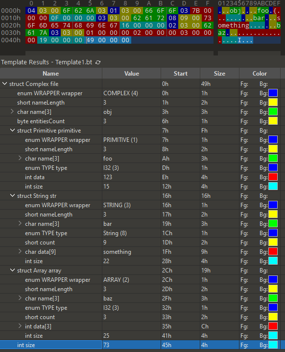

# Serialization

Simple binary serializer and deserializer.

## Usage

### Serialization

```csharp
Complex obj = new Complex("obj");

var foo = Primitive.Create("foo", 123);
var bar = Array.Create("bar", "something");
var baz = Array.Create("baz", new int[] { 1, 2, 3 });

obj.AddEntity(foo);
obj.AddEntity(bar);
obj.AddEntity(baz);

Util.RetriveNSave(obj);
```

<details>
<summary>010 Editor Screenshot</summary>


</details>
 
 

### Deserialization

```csharp
var objectFromFile = Util.Load(file);

Int16 iterator = 0;
var root = Util.Deserialize(ref objectFromFile, ref iterator);
```

To get all values from root object and dump it to output
```csharp
JObject obj = new JObject();
Util.Dump(ref root, ref obj);

Console.WriteLine(obj.ToString(Newtonsoft.Json.Formatting.Indented));
```

It should output to console window this json
```json
{
  "obj": {
    "foo": 123,
    "bar": "something",
    "baz": [
      1,
      2,
      3
    ]
  }
}
```